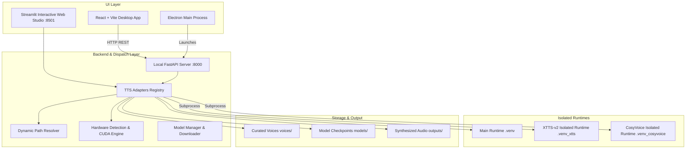

# TTS Studio — Production Zero-Shot Neural Voice Cloning System

[](https://www.python.org/)
[](https://pytorch.org/)
[](https://www.electronjs.org/)
[](https://react.dev/)
[](https://tailwindcss.com/)
[](LICENSE)

**TTS Studio** (Video Automation Pipeline) is a production-grade, zero-shot neural voice cloning and speech synthesis application. It brings state-of-the-art neural speech models into a unified, user-friendly platform with both an **Interactive Streamlit Web Studio** and a **Standalone Electron Desktop Application**.

---

## 🌟 Key Features

- **7 State-of-the-Art Neural Voice Cloning Engines**:
  - **F5-TTS**: DiT (Diffusion Transformer) Flow Matching zero-shot cloner with fast/slow ODE steps.
  - **Chatterbox Turbo**: High-speed diffusion-based voice cloner.
  - **Fish Speech S2**: DualAR LLM with 512-dim DAC discrete acoustic neural vocoder.
  - **OmniVoice**: 527-layer Flow Matching Transformer.
  - **CosyVoice 3**: FunAudioLLM 300M multi-lingual zero-shot voice cloner.
  - **XTTS-v2**: Coqui Multilingual zero-shot cloner supporting 17+ languages.
  - **IndexTTS 2.5**: UnifiedVoice GPT + S2Mel + BigVGAN neural vocoder.
- **Dual User Interfaces**:
  - **Streamlit Web Studio** (`app.py`): Rapid browser interface with real-time waveform inspection, telemetry, benchmark charts, and model management.
  - **Electron Desktop Studio** (`desktop/` & root build): Modern React + Vite + TypeScript + Tailwind CSS desktop app with local API backend.
- **Process & Environment Isolation**:
  - Independent virtual runtime runners (`.venv_cosyvoice`, `.venv_xtts`, etc.) to eliminate dependency and CUDA conflicts between competing neural speech frameworks.
- **Intelligent Text Preprocessing & Chunking**:
  - Hierarchical semantic chunking (punctuation, clause, and word count boundaries up to 2,000 words).
  - Neural stress normalization (converts markdown emphasis to capitalized neural stress tokens).
  - Pronunciation dictionary replacement (`configs/pronunciation_map.json`).
- **Zero-Shot Voice Library**:
  - Curated reference audio recordings in `voices/` spanning multiple categories: Audiobook, Narration, Podcast, Presentation, Storytelling, Social Media, and Announcements.
- **Hardware Acceleration with Automatic Fallback**:
  - Auto-probes NVIDIA GPUs, CUDA capabilities, driver versions, and VRAM.
  - Automatically selects `CUDA` or falls back to optimized `CPU` execution with clear diagnostic messaging.
- **Resumable Model Downloader**:
  - Automated weights acquisition from Hugging Face / ModelScope with checksum validation, retry policies, and disk verification.

---

## 🏗️ System Architecture



---

## 📋 System Requirements

| Specification | Minimum (CPU Mode) | Recommended (GPU Mode) |
|---|---|---|
| **Operating System** | Windows 10/11 (64-bit) | Windows 10/11 (64-bit) |
| **Processor (CPU)** | Intel i5 8th Gen+ / Ryzen 5 2000+ | Intel i7/i9 10th Gen+ / Ryzen 7/9 3000+ |
| **System Memory (RAM)** | 16 GB DDR4 | 32 GB DDR4/DDR5 |
| **GPU / VRAM** | Integrated / Non-NVIDIA GPU | NVIDIA RTX 3060+ (6 GB+ VRAM, 8 GB+ recommended) |
| **NVIDIA Driver** | N/A | Version 535.xx+ or 550.xx+ (CUDA 12.x compatible) |
| **Disk Space** | 15 GB free SSD space | 35 GB free NVMe SSD space (for all models) |

For detailed hardware requirements, see [docs/SYSTEM_REQUIREMENTS.md](file:///e:/TTS/docs/SYSTEM_REQUIREMENTS.md).

---

## 🚀 Quick Start Guide

### 1. Repository Setup & Environment

Clone the repository and prepare your Python virtual environment:

```powershell
# Clone the repository
git clone https://github.com/Aryan140314/Video-Automation-Pipeline.git
cd Video-Automation-Pipeline

# Create and activate Python virtual environment
python -m venv .venv
.\.venv\Scripts\Activate.ps1

# Install core dependencies
pip install --upgrade pip
pip install -r requirements.txt
```

### 2. Option A: Launch Streamlit Web Studio (Fastest)

To launch the web-based interactive voice cloning interface:

```powershell
streamlit run app.py
```
Or with Python:
```powershell
python -m streamlit run app.py
```
Open your browser at `http://localhost:8501`.

### 3. Option B: Launch Electron Desktop Studio

#### Running in Development Mode:
```powershell
# Navigate to desktop app directory
cd desktop
npm install
npm run dev
```

#### Running the Backend API Server Standalone:
```powershell
python scripts/desktop_server.py
```
The REST API server starts on `http://127.0.0.1:8000`.

### 4. Building the Desktop Installer (`.exe`)

To build the standalone Windows NSIS installer:
```powershell
cd desktop
npm run electron:build
```
The installer will be generated in `desktop/release/`.

---

## 🎙️ Supported Neural Models Matrix

| Model | Architecture | Primary Strength | Sample Rate | Recommended Hardware |
|---|---|---|---|---|
| **F5-TTS** | DiT Flow Matching | Natural cadence & speed | 24 kHz | GPU (4 GB+) / CPU |
| **Chatterbox Turbo** | Diffusion Speech Cloner | Expressive pitch & emotion | 24 kHz | GPU (4 GB+) / CPU |
| **Fish Speech S2** | DualAR LLM + DAC | High fidelity long-form | 44.1 kHz | GPU (8 GB+) |
| **CosyVoice 3** | FunAudioLLM 300M | Multi-lingual & zero-shot tone | 22.05 kHz | GPU (6 GB+) |
| **XTTS-v2** | Coqui Multilingual V2 | 17+ languages voice cloning | 24 kHz | GPU (6 GB+) / CPU |
| **OmniVoice** | 527-Layer Flow Transformer | Deep contextual inflection | 24 kHz | GPU (8 GB+) |
| **IndexTTS 2.5** | UnifiedVoice GPT + BigVGAN | High-speed neural vocoding | 24 kHz | GPU (6 GB+) |

For runtime details and PyTorch versions, see [docs/MODEL_RUNTIME_MATRIX.md](file:///e:/TTS/docs/MODEL_RUNTIME_MATRIX.md).

---

## 📁 Repository Directory Layout

```
Video-Automation-Pipeline/
├── app.py                     # Streamlit Interactive Web Application
├── desktop/                   # React + Vite + TypeScript + Electron Desktop Suite
│   ├── electron/              # Electron main and preload scripts
│   ├── src/                   # React components, UI pages, and Zustand store
│   ├── electron-builder.json5 # Desktop packaging specification
│   ├── package.json           # Node.js dependencies and build scripts
│   └── vite.config.ts         # Vite build configuration
├── backend/                   # Core FastAPI backend router and schemas
├── configs/                   # Model manifests and pronunciation dictionaries
│   ├── model_manifest.json    # Model weights sources, mirrors, and checksums
│   └── pronunciation_map.json # Custom phonetic replacement mapping
├── docs/                      # Comprehensive technical documentation
│   ├── ARCHITECTURE.md        # Master system architecture & diagrams
│   ├── SYSTEM_REQUIREMENTS.md # Hardware tiers & OS support
│   ├── PACKAGING.md           # Standalone packaging & installer specs
│   ├── EXISTING_PIPELINE.md   # Speech synthesis helper and adapter trace
│   ├── MODEL_RUNTIME_MATRIX.md# Model environment compatibility
│   └── TESTING.md             # Verification protocols and regression tests
├── models/                    # Neural model checkpoint storage (git-ignored)
├── outputs/                   # Generated audio WAV files and benchmark CSVs
│   └── synthesis_benchmark.csv# Performance logging and telemetry
├── requirements/              # Modular dependency specifications per engine
├── scripts/                   # Core engine adapters, managers, and runners
│   ├── tts_adapters.py        # Central model adapter registry
│   ├── speech_synth_helper.py # Preprocessing, chunking, and generation logic
│   ├── hardware_detector.py   # GPU/CPU probing and CUDA device detection
│   ├── path_resolver.py       # Dynamic environment and storage resolution
│   ├── model_manager.py       # Checkpoint verification and acquisition
│   ├── downloader.py          # Resumable multi-threaded HTTP downloader
│   ├── desktop_server.py      # Local REST API server for the desktop UI
│   ├── isolated_*_runner.py   # Subprocess runners for isolated virtualenvs
│   └── synthesis_benchmark.py # Automated generation benchmark suite
├── tests/                     # Automated unit and integration tests
└── voices/                    # Curated zero-shot reference voice assets
    ├── Audiobook/             # Warm, expressive narration samples
    ├── Narration/             # Clear, neutral voice samples
    ├── Podcast/               # Conversational audio samples
    └── Storytelling/          # Dramatic, engaging voice samples
```

---

## 🧪 Testing & Diagnostics

Run integration tests and hardware detection diagnostics:

```powershell
# Run hardware detection diagnostic
python scripts/hardware_detector.py

# Run synthesis benchmark suite across models
python scripts/synthesis_benchmark.py

# Run automated test suite
pytest tests/
```

---

## 📖 Further Documentation

Explore detailed technical specifications in the [`docs/`](docs/) directory:
- [System Architecture](docs/ARCHITECTURE.md)
- [System Requirements](docs/SYSTEM_REQUIREMENTS.md)
- [Packaging & Installer Protocol](docs/PACKAGING.md)
- [Speech Pipeline Execution Trace](docs/EXISTING_PIPELINE.md)
- [Model Runtime Matrix](docs/MODEL_RUNTIME_MATRIX.md)
- [Voice Asset Inventory](docs/VOICE_ASSET_INVENTORY.md)
- [Testing & QA Protocols](docs/TESTING.md)

---

## 📄 License

This project is licensed under the MIT License - see the [LICENSE](LICENSE) file for details.
