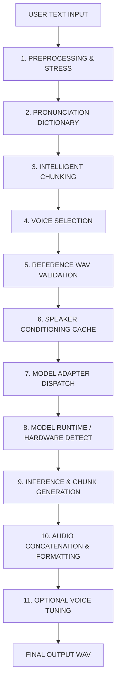

# Existing TTS Pipeline Audit & Source-of-Truth Architectural Trace

## 1. Executive Summary
This document provides the authoritative end-to-end trace of the existing TTS generation logic implemented in [`scripts/tts_adapters.py`](file:///e:/TTS/scripts/tts_adapters.py) and [`scripts/speech_synth_helper.py`](file:///e:/TTS/scripts/speech_synth_helper.py).

This pipeline represents the exact functional baseline that must be wrapped and preserved without altering generation parameters, preprocessing, text normalization, chunking strategies, or zero-shot reference voice audio assets.

---

## 2. Complete Text-to-Audio Execution Flow



---

## 3. Step-by-Step Pipeline Specifications

### Step 1: Preprocessing & Neural Stress
- **Implementation**: [`speech_synth_helper.py:preprocess_tts_text`](file:///e:/TTS/scripts/speech_synth_helper.py#L447-L491)
- **Behavior**:
  1. Converts custom pause tags (`[pause]`, `[break]`, `<pause>`, `<break>`) into ellipsis pauses (`...`).
  2. Converts markdown formatting (`**word**` bolding and `*word*` italics) into capitalized text (`WORD`) to trigger natural stress in neural TTS models.

### Step 2: Pronunciation Dictionary Processing
- **Implementation**: [`speech_synth_helper.py:preprocess_tts_text`](file:///e:/TTS/scripts/speech_synth_helper.py#L465-L490)
- **Behavior**:
  1. Hardcoded technical acronym pronunciations:
     - `TTS` $\rightarrow$ `T-T-S`
     - `VRAM` $\rightarrow$ `V-RAM`
     - `RTF` $\rightarrow$ `R-T-F`
     - `CPU` $\rightarrow$ `C-P-U`
     - `GPU` $\rightarrow$ `G-P-U`
  2. Dynamically merges user-defined pronunciation entries from `configs/pronunciation_map.json`.
  3. Uses regex boundary matching (`\bWORD\b`) with case-insensitivity to perform safe word replacement.

### Step 3: Intelligent Chunking Strategy
- **Implementation**: [`tts_adapters.py:IntelligentChunker`](file:///e:/TTS/scripts/tts_adapters.py#L66-L131) and [`speech_synth_helper.py:_chunk_text_for_f5tts`](file:///e:/TTS/scripts/speech_synth_helper.py#L42-L90)
- **Behavior**:
  1. Accommodates user text up to 2,000 words.
  2. Hierarchical splitting sequence:
     - Paragraph / Sentence boundaries (`. ! ? ; \n`)
     - Clause boundaries (commas `,`)
     - Word count limits (default 60 words per chunk for optimal DiT / diffusion context fitting)
  3. Tokenizer-aware length validation (if model tokenizer is provided).

### Step 4: Voice Selection & Reference WAV Lookup
- **Implementation**: Maps selected category to source-of-truth WAV in `voices/<Category>/<file>.wav`.
- **Behavior**: Resolves category to exact zero-shot audio file without modifying audio data.

### Step 5: Reference WAV Validation
- **Implementation**: [`speech_synth_helper.py:synthesize_human_speech`](file:///e:/TTS/scripts/speech_synth_helper.py#L535-L539)
- **Behavior**: Validates that reference voice file exists and size is $> 1000$ bytes.

### Step 6: Speaker Conditioning & Embedding Cache
- **Implementation**: [`tts_adapters.py:SpeakerConditioningCache`](file:///e:/TTS/scripts/tts_adapters.py#L37-L60)
- **Behavior**: Caches precomputed speaker conditioning features keyed by `(audio_path, mtime, key_suffix)` to eliminate redundant embedding extractions across requests.

### Step 7 & 8: Model Adapter Dispatch & Hardware Detection
- **Implementation**: [`tts_adapters.py:get_adapter`](file:///e:/TTS/scripts/tts_adapters.py#L658-L665)
- **Behavior**: Retrieves adapter from factory registry (`f5tts`, `chatterbox`, `fishspeech`, `omnivoice`, `cosyvoice`, `xttsv2`, `indextts2`). Detects CUDA availability (`torch.cuda.is_available()`).

### Step 9 & 10: Inference, Chunk Synthesis & Concatenation
- **Implementation**: Model-specific `generate()` methods in adapter classes.
- **Behavior**: Synthesizes audio per chunk, concatenates chunk tensors/arrays (`torch.cat` or `np.concatenate`), and exports standard WAV.

### Step 11: Audio Format & Performance Metadata
- **Behavior**: Measures synthesis time (`gen_time`), calculates duration via WAV header, computes Real-Time Factor ($\text{RTF} = \frac{\text{gen\_time}}{\text{duration}}$), and measures file size in KB. Returns standardized performance dictionary:

```json
{
  "model": "f5tts",
  "model_name": "F5-TTS",
  "backend": "f5tts-clone",
  "cloning_active": true,
  "gen_time": 1.45,
  "duration": 4.20,
  "rtf": 0.3452,
  "file_size_kb": 198.5,
  "output_path": "outputs/f5tts/f5tts_output.wav",
  "device": "cuda"
}
```
