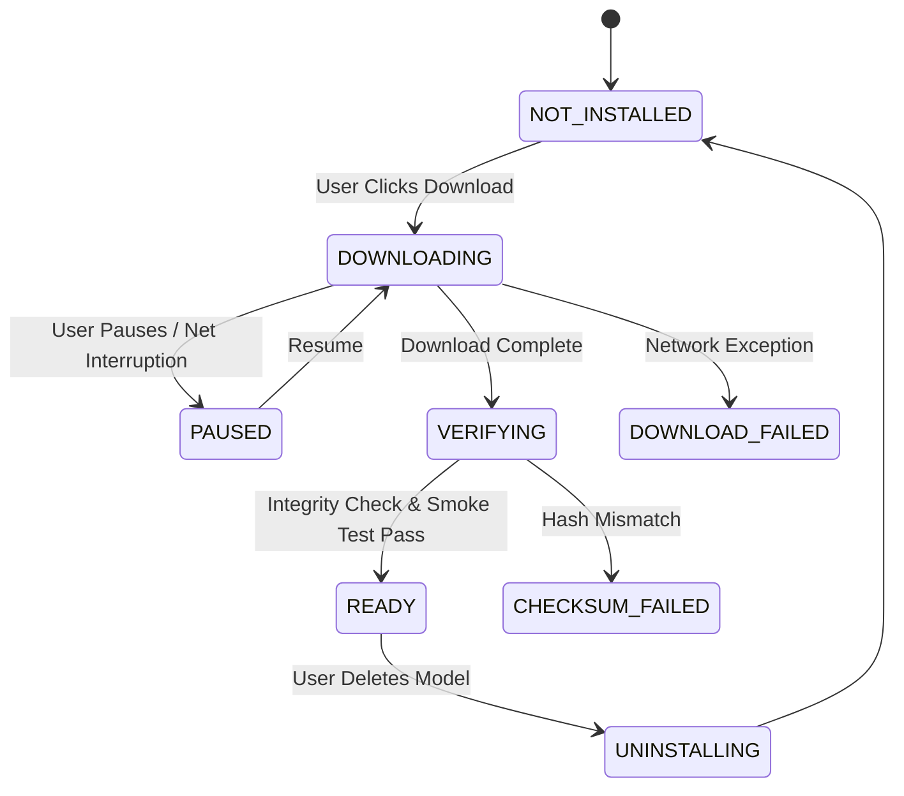

# Model Download Architecture, Storage & Verification Flow

## 1. Overview
Large ML models (ranging from 1.1 GB to 2.5 GB) are not bundled inside the `TTS Studio.exe` installer binary to keep installer size manageable. Instead, the application features an integrated, official Model Downloader and Lifecycle Manager.

---

## 2. Model Weight Storage Layout
All production models, caches, logs, configurations, and outputs are stored dynamically under user app data:

```
%LOCALAPPDATA%\TTS-Studio\
├── models\
│   ├── f5tts\
│   ├── chatterbox\
│   ├── fishspeech\
│   ├── omnivoice\
│   ├── cosyvoice\
│   ├── xttsv2\
│   └── indextts2\
├── runtimes\
├── cache\
├── outputs\
├── logs\
└── config\
```

---

## 3. Download Lifecycle State Machine



---

## 4. Key Download System Features
- **Official Model Repositories**: Downloads strictly from official Hugging Face repositories (`SWAVE-LAB/F5-TTS`, `chatterbox-tts`, `coqui-ai/TTS`, etc.).
- **Resumable Downloads**: Uses HTTP range requests (`Range: bytes=x-y`) and stream buffers via `httpx` to support pause/resume/retry without restarting multi-gigabyte downloads.
- **Integrity Verification**: Checks file sizes and SHA256 checksums post-download.
- **Smoke Testing**: Runs a mini inference test upon installation before flagging model status as `READY`.
